# Homework1

## 目标
结合第2章和第3章课件内容，了解Stata使用方法并实现相应的统计功能

## 代码&结果

### 课件2
```stata
use "\proj\grilic_small.dta"
label variable s "schooling"
d
l s
l s lnw in 11/15
l s lnw if s>=16
sort s
l s expr lnw
histogram s, width(1) frequency
scatter lnw s
gen n=_n
scatter lnw s, mlabel(n)
summarize s
sum
tabulate s
pwcorr lnw s expr, sig star(0.05)

```
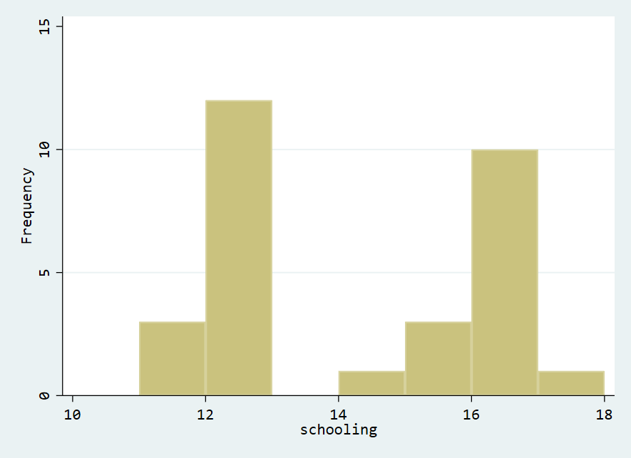
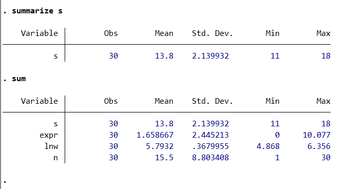
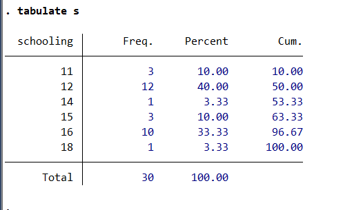


### 课件3
```stata
use "\proj\statics\grilic.dta"
describe
sum lnw,detail
hist lnw,width(0.1)
kdensity lnw,normal normop(lpattern(dash))
gen wage=exp(lnw)
kdensity wage
kdensity lnw if s==16
twoway kdensity lnw || kdensity lnw if s==16,lpattern(dash)
sum lnw
sum lnw if s==16
sum lnw if rns==0
sum lnw if rns==1
dis 5.725644*(554/(554+204))+5.581083*(204/(554+204))
sum lnw

dis normal(1.96)
twoway function y=normalden(x),range(-5 5)xline(0) ytitle(概率密度)

twoway function y=normalden(x),range(-5 10) ||function z=normalden(x,1,2),range(-5 10)lpattern(dash) ytitle(概率密度)

twoway function chi3=chi2den(3,x),range(0 20) || function chi5=chi2den(5,x),range(0 20) lpattern(dash) ytitle(概率密度)

twoway function t1=tden(1,x),range(-5 5) || function t5=tden(5,x),range(-5 5) lpattern(dash) ytitle(概率密度)

twoway function F20=Fden(10,20,x),range(0 5) || function F5=Fden(10,5,x),range(0 5)lpattern(dash) ytitle(概率密度)
```
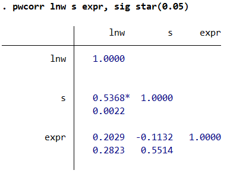
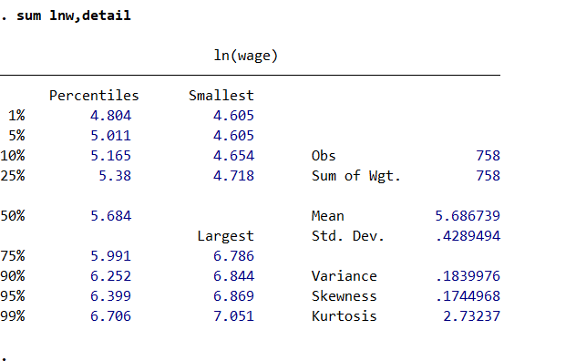
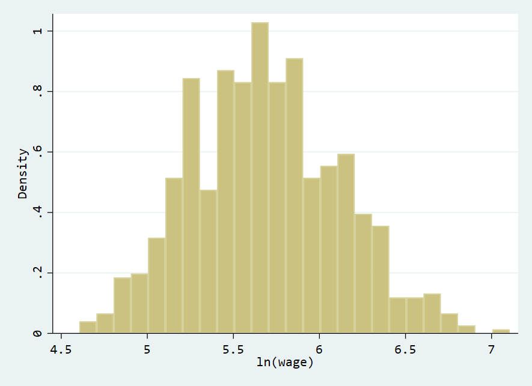
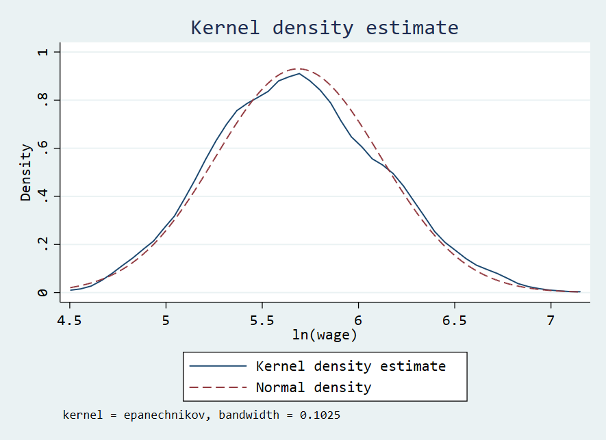
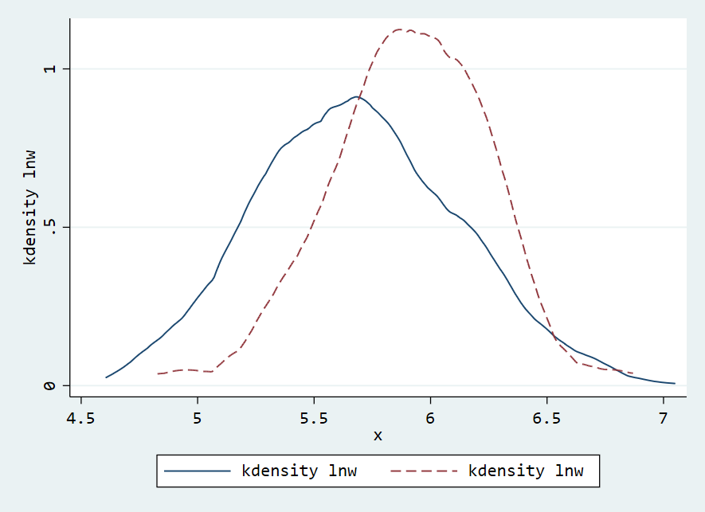
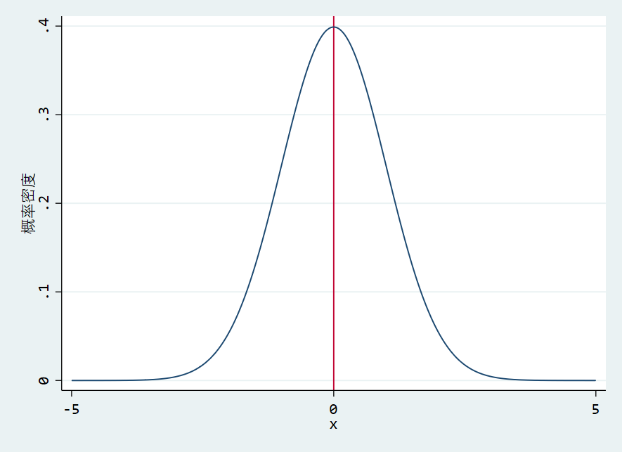
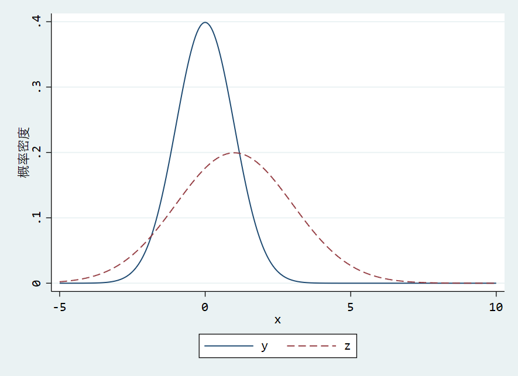
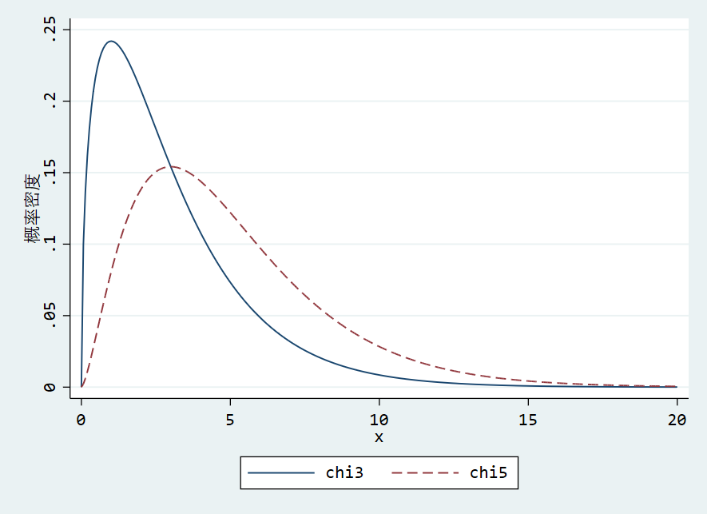
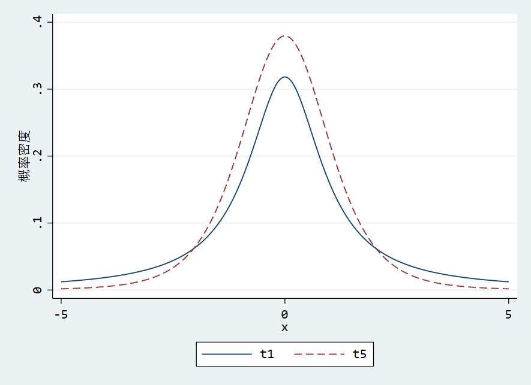
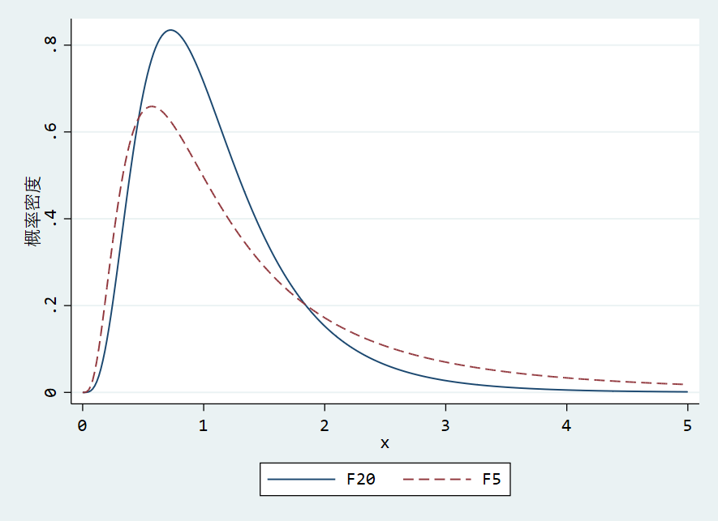
